# index


## evolution on X
The production of gametes in sexually reproducing organisms is a complex, tightly regulated process involving numerous cellular and molecular mechanisms. In males, spermatogenesis—the process by which sperm are formed—progresses through four main stages of differentiation: from germ cells to spermatogonia, then to pachytene spermatocytes, round spermatids, and finally to mature spermatozoa [@Wang2019](Wang et al. 2019). This process is fundamental to male fertility. Meiosis, a specialized form of cell division, ensures the proper pairing, recombination, and segregation of homologous chromosomes, thereby maintaining genetic integrity and promoting variation. A deep understanding of these molecular events is essential for comprehending inheritance, speciation, population genetics, and the biological causes of infertility.

Sex chromosomes differ from autosomes in several key ways due to their distinct patterns of inheritance and copy number. The Y chromosome is found only in males and exists as a single copy. In contrast, the X chromosome follows a more complex inheritance pattern: females carry two copies, while males carry only one. Consequently, the X chromosome resides two-thirds of the time in females and one-third in males, a distribution that influences how selection acts upon it. In males, the hemizygous nature of the X chromosome means that any mutations or deleterious alleles are fully exposed, without a second copy to mask their effects.

This feature is central to Haldane’s rule [@Haldane1922] (Haldane 1922), which posits that in hybrids between two species, the heterogametic sex (e.g., XY in mammals or ZW in birds) is more likely to be inviable or sterile. While widely observed, the precise causes of this pattern remain a subject of ongoing debate. Several hypotheses have been proposed to explain it. One suggests that incompatibilities involving the Y chromosome can arise if it fails to remain compatible with the X chromosome or autosomes. Another centers on dosage compensation, proposing that hybridization may disrupt the regulatory mechanisms that balance gene expression between sex chromosomes. The dominance hypothesis argues that recessive deleterious alleles may be unmasked in the heterogametic sex, leading to sterility. Additional ideas include the faster evolution of male-biased reproductive genes, which can result in functional mismatches, and the accelerated divergence of X-linked loci compared to autosomes, known as faster-X evolution. Lastly, meiotic drive—genetic conflicts between selfish elements on sex chromosomes—has also been implicated in hybrid sterility.

These hypotheses underscore the complex interplay between sex chromosomes, selection, and hybridization [@Cowell2023] (Cowell 2023). Although Haldane’s rule is consistently observed across diverse taxa—and even across kingdoms—the underlying mechanisms are not universally agreed upon. In many cases, multiple processes may act together [@Lindholm2016] (Lindholm et al. 2016).

The X chromosome, in particular, appears to be subject to strong and unique selective pressures, especially in primates. This topic is explored in greater depth in the following sections.

## Chromatin structure

Regions under strong selection across primate species—including humans and baboons—are consistently found on the X chromosome, spanning megabase-scale genomic areas. As previously noted, factors such as chromosomal architecture and structural rearrangements may play crucial roles in enabling, regulating, or insulating these regions from selective pressures.

Understanding genome organization and variation is therefore essential for uncovering the mechanisms behind selection. Chromatin has long been recognized as central to gene regulation and cellular function [@LiebermanAiden2009] (Lieberman-Aiden et al. 2009), in part because the 3D structure of chromosomes brings distant genomic elements into close contact. Disruption of this spatial organization can lead to developmental abnormalities [@Dixon2015] (Dixon et al. 2015). Chromatin is organized hierarchically, with multiple levels of structure nested within one another (see Figure 2). At the broadest level, chromatin compartments can span several megabases [@LiebermanAiden2009] (Lieberman-Aiden et al. 2009), while at finer scales, even 500 base pairs can contribute to subgenic structural organization. Structures such as topologically associating domains (TADs) and chromatin loops, which operate at sub-megabase scales, further help partition regulatory elements and maintain proper genomic function [@Ramirez2018][@Zuo2021](Ramírez et al. 2018; Zuo et al. 2021).


Chromatin, the complex of DNA wrapped around histone proteins and associated with various regulatory factors, plays a central role in the spatial and temporal control of gene expression, as well as in maintaining the structural integrity and stability of the genome [@allshire2016epigenetics; @bannister2011histone]. Far from being a static scaffold, chromatin is a highly dynamic entity, subject to extensive remodeling in response to cellular signals, developmental cues, and environmental stimuli [@maeshima2020dynamic]. Its organization within the nucleus is hierarchical, ranging from nucleosomes to higher-order domains, and this architecture can differ substantially across cell types, developmental stages, and even between closely related species [@rowley2018organizational; @bonev2017organization].

One of the key features of chromatin organization is its division into functionally distinct states—broadly classified as euchromatin, which is generally open and transcriptionally active, and heterochromatin, which is compacted and repressive [@grewal2007heterochromatin; @bickmore2013euchromatin]. Transitions between these states, whether developmentally programmed or evolutionarily emergent, are often tightly coupled to shifts in gene regulatory activity and cellular identity [@arnold2022chromatin].

In this study, we focus on characterizing these chromatin state transitions, with a particular interest in understanding how they are distributed across the genome and whether they exhibit predictable patterns linked to specific sequence features or regulatory elements. We ask whether certain genomic regions are more prone to undergoing structural reorganization and whether such regions harbor conserved sequence motifs, epigenetic signatures, or binding sites for key regulatory proteins [@zhou2011dna; @ernst2011mapping]. Furthermore, we investigate whether particular chromatin configurations are disproportionately associated with genes involved in critical biological processes or with regions of the genome that show signatures of evolutionary constraint or adaptation [@kundaje2015integrative].

By examining the diversity of chromatin states and transitions across individuals and lineages, we also aim to uncover broader principles governing chromatin architecture and its functional consequences [@marx2019singlecell]. These insights may inform our understanding of how chromatin organization evolves, how it contributes to phenotypic diversity, and how its dysregulation may underlie disease states [@buenrostro2015atacseq]. Ultimately, this work contributes to a growing body of knowledge on the interplay between genome structure, function, and evolution.


## A/B configurations

One of the most fundamental and widely studied features of three-dimensional genome organization is its partitioning into A and B compartments, originally revealed by high-throughput chromosome conformation capture techniques such as Hi-C [@LiebermanAiden2009]. These compartments represent megabase-scale regions of the genome that differ significantly in their epigenetic state, transcriptional activity, nuclear positioning, and physical interaction profiles. The identification of compartments via principal component analysis (PCA) of Hi-C matrices has become a cornerstone in mapping chromatin architecture across species and cell types.

The A compartment is typically associated with euchromatin—open, accessible chromatin that supports active gene expression. Regions within A compartments are enriched with transcriptionally active histone modifications, including H3K27ac, H3K4me3, and H3K36me3, as well as high levels of DNase I hypersensitivity, RNA polymerase II occupancy, and active transcription [@han2023epigenome3d; @wen2022compartmentalization; @lu2021homotypic]. In contrast, B compartments correspond to heterochromatic domains, which are transcriptionally silent or repressed. These regions are often localized near the nuclear lamina, marked by H3K9me3, H3K27me3, Lamin B1 association, and DNA methylation, and exhibit low transcriptional activity [@han2023epigenome3d; @lu2021homotypic; @feng2020h3k9me3architecture]. The biochemical and physical segregation of chromatin into A and B compartments reinforces a higher-order regulatory framework for genome function [@lucini2024biochemical].

Importantly, A/B compartment identity is not fixed but can undergo dynamic switching in response to developmental cues, environmental stimuli, cell differentiation, aging, or disease states such as cancer and senescence. This process, referred to as compartment switching, entails a region transitioning from a repressive B compartment to an active A compartment (or vice versa), often accompanied by changes in chromatin accessibility, histone modification landscapes, and gene expression profiles [@zhang2021senescence; @lucini2024biochemical; @wen2022compartmentalization]. For instance, during lineage specification or upon activation of certain signaling pathways, genes or regulatory loci may shift from a transcriptionally repressive nuclear environment to one permissive for gene activation. This spatial repositioning allows cells to coordinate complex transcriptional programs in a spatiotemporally regulated manner.

At the structural level, compartmental identity correlates with nuclear topography: A compartments tend to localize to the nuclear interior and are often associated with nuclear speckles—subnuclear domains involved in transcriptional and RNA processing. B compartments, on the other hand, are frequently found near the nuclear lamina, where gene silencing is promoted through anchoring and phase-separated heterochromatin domains [@lu2021homotypic; @feng2020h3k9me3architecture].

From an evolutionary perspective, comparative Hi-C and epigenomic studies across species have revealed that certain A and B compartmental domains are highly conserved, especially those involving developmental genes, housekeeping genes, and essential regulatory networks [@valadezgraham2020chromatin]. However, other regions—particularly those involved in immune response, sensory perception, or species-specific traits—exhibit compartmental plasticity, reflecting their role in adaptive evolution and phenotypic diversity. For example, chromatin compartments in plants, mammals, and even non-model organisms show patterns of both conservation and innovation in their compartmental structures, highlighting the flexibility of genome organization mechanisms in accommodating species-specific regulatory needs [@wen2022compartmentalization].

The study of A/B compartment dynamics not only offers insights into basic principles of genome function but also provides a framework for understanding disease-associated epigenetic reprogramming, evolutionary divergence, and the mechanistic underpinnings of cell identity.


## GPN
Recent advances in artificial intelligence have brought powerful tools to genomics, particularly through the development of Genomic Pre-trained Networks (GPNs)—deep learning models trained on large-scale genomic sequence data using architectures inspired by natural language processing. GPNs apply self-supervised learning approaches, analogous to models like BERT or GPT, to the DNA sequence, learning to predict masked or missing bases in context. Through this training, GPNs develop an internal representation of the "language of the genome," capturing patterns of sequence composition, motif syntax, and long-range dependencies that underlie regulatory function.

A key advantage of GPNs lies in their use of transformer architectures, which differ significantly from traditional models like convolutional neural networks (CNNs). While CNNs are adept at recognizing short, fixed-length patterns—such as transcription factor binding motifs—they struggle with learning dependencies over long genomic distances, such as enhancer-promoter interactions or 3D chromatin looping. Transformers, in contrast, leverage self-attention mechanisms, which allow the model to compare and weigh relationships between all nucleotide positions in a sequence, regardless of distance. This makes them exceptionally well-suited for modeling the complex, multi-scale structure of regulatory DNA.

The utility of GPNs in functional genomics has been demonstrated in tasks such as predicting the effects of noncoding variants, chromatin accessibility, and transcription factor binding. For instance, the model introduced by Benegas and Batra ("DNA language models are powerful predictors of genome-wide variant effects") showed that transformer-based GPNs outperform prior models in predicting variant impact across a variety of cell types and epigenomic contexts, even without explicit annotations. These models can generate base-resolution functional predictions across the genome, enabling insight into the likely regulatory role of any given sequence segment.

In the context of chromatin structure, GPNs hold particular promise for identifying sequence features that influence or correlate with A/B compartment identity. By learning patterns that distinguish sequences in open (A) versus closed (B) chromatin, GPNs can be used to predict how shifts in compartmentalization may arise from sequence variation. Furthermore, these predictions can be extended across species or populations to assess functional conservation—that is, whether a sequence maintains regulatory potential or compartment association despite genetic divergence.

In this study, we leverage GPN-derived embeddings and predictions to investigate the sequence determinants of chromatin organization. We aim to identify genomic regions where the GPN model predicts strong, conserved regulatory activity, and determine whether these regions also show structural stability in chromatin compartments across individuals or hybrid genomes. This approach allows us to assess whether chromatin transitions are driven primarily by changes in DNA sequence, or whether other regulatory layers (e.g., epigenetic modifications, chromatin remodelers) are required to explain shifts between A and B compartments.

Ultimately, integrating GPN predictions with chromatin conformation data (e.g., from Hi-C) provides a powerful framework for exploring genome function at multiple scales—from base-level regulatory logic to large-scale nuclear organization. These models not only enhance our ability to interpret genomic variation and conservation but also open new avenues for studying the evolution of regulatory architecture in systems such as primates, where hybridization and population structure offer unique opportunities to dissect genome regulation in action.

## cnn vs transformer
Convolutional Neural Networks (CNNs) have been the foundational architecture in computer vision for over a decade. Introduced by LeCun et al. (1998) and popularized with the success of AlexNet (Krizhevsky et al., 2012), CNNs exploit spatial hierarchies in image data through local receptive fields and shared weights. Architectures such as VGGNet (Simonyan & Zisserman, 2015), ResNet (He et al., 2016), and EfficientNet (Tan & Le, 2019) have progressively improved the depth, scalability, and performance of CNNs, enabling state-of-the-art results in tasks such as image classification, object detection, and semantic segmentation.

A simple Convolutional Neural Network (CNN) architecture typically consists of several key types of layers. The first are convolutional layers, which apply learnable filters (also known as kernels) to local regions of the input data. These filters are designed to capture spatial features such as edges, textures, and, as the network deepens, more complex patterns. Following the convolutional operations, activation functions are applied—most commonly the Rectified Linear Unit (ReLU)—to introduce non-linearity into the model, enabling it to learn more complex representations.

Pooling layers are another essential component of CNNs. These layers downsample the feature maps, typically using max pooling or average pooling, which reduces the spatial dimensions of the data while retaining the most salient features. This not only lowers computational requirements but also helps mitigate overfitting by providing a form of translation invariance. Toward the end of the architecture, fully connected layers are often used to perform high-level reasoning. These layers integrate the features extracted by earlier layers and are typically responsible for producing the final classification or regression outputs.

One of the main strengths of CNNs lies in their use of local receptive fields and weight sharing, which makes them highly effective at learning spatial hierarchies and translation-invariant features. Even relatively shallow CNNs can perform well on image-related tasks, particularly when training data is limited.

CNNs offer several advantages. They are parameter-efficient due to filter sharing, which significantly reduces the number of learnable weights compared to fully connected networks. Their strong inductive bias—emphasizing locality and translation invariance—makes them particularly well-suited to visual data. Additionally, CNNs benefit from computational efficiency, as they are compatible with highly optimized GPU-based implementations, and they often require less data than more recent architectures to achieve good performance.

However, CNNs also come with limitations. They tend to focus on local features, which makes capturing long-range dependencies challenging without additional architectural mechanisms. Their receptive field is fixed and limited, so incorporating larger contextual information often requires making the network deeper or using special techniques like dilated convolutions or skip connections. Furthermore, CNN performance can be sensitive to architectural choices such as filter sizes, layer depth, and stride configurations, which often require manual tuning.

These challenges have inspired researchers to explore alternative architectures, most notably Transformer models. Unlike CNNs, Transformers are designed to model global relationships more naturally, though often at the expense of requiring more data and computational resources.


## miosis 

Meiosis is the defining process of spermatogenesis, transforming diploid precursors into haploid gametes while introducing genetic diversity. The stages represented in this dataset highlight distinct steps in this transformation[@Berg2019].

Spermatogonia are the mitotically active germline stem and progenitor cells at the basal compartment of the seminiferous tubules. Although they themselves do not undergo meiosis, they form the essential starting population that differentiates into spermatocytes, committing cells to the meiotic program[@Berg2019].

Pachytene spermatocytes represent a central point in meiosis, specifically prophase I. During this prolonged phase, homologous chromosomes are fully synapsed through the synaptonemal complex, and crossing-over ensures genetic recombination. This is a transcriptionally active stage, producing RNAs that will later support spermatid development when transcription decreases[@Berg2019].

Round spermatids are the direct products of the two meiotic divisions. They are haploid cells that no longer divide but instead undergo spermiogenesis, a process of dramatic morphological and chromatin remodeling. Although post-meiotic, they carry the molecular signatures of meiotic recombination and genome reduction[@Berg2019].

During spermatogenesis, large-scale reprogramming of three-dimensional (3D) chromatin organization is required to enable meiosis and germ cell differentiation. Recent studies using low-input Hi-C in both rhesus monkeys and mice have revealed that the higher-order chromatin landscape is far from static. Instead, it undergoes stage-specific remodeling in which topologically associating domains (TADs), normally stable units of genome folding, become progressively dissolved as germ cells enter meiotic prophase. This disruption reaches its peak in pachytene spermatocytes, where TADs are almost entirely absent despite the presence of widespread transcriptional activity [@Wang2019].

Interestingly, the loss of TADs at this stage is accompanied by the emergence of refined A/B compartments. These compartments alternate between transcriptionally active and inactive regions, providing a new level of chromatin organization that correlates more directly with gene expression than classical TAD structures. Such reorganization suggests that the meiotic genome adopts a unique 3D folding principle optimized for homologous recombination and transcriptional control [@Wang2019].

A key driver of this transition appears to be the synaptonemal complex (SC), a protein scaffold that aligns homologous chromosomes during meiosis. Wang and colleagues demonstrated that in spermatocytes lacking proper SC formation, refined compartments fail to develop, and TAD-like structures re-emerge prematurely. This finding indicates that the SC does not merely stabilize chromosome pairing, but also actively contributes to global chromatin architecture by suppressing TADs and promoting compartmentalization [@Wang2019].

Overall, this work highlights that spermatogenesis involves not only dynamic transcriptional and epigenetic changes but also profound reprogramming of chromatin folding. The discovery that such architectural shifts are conserved between primates and rodents underscores their biological importance. Furthermore, it raises the possibility that defects in these processes could contribute to infertility or other germline disorders, linking 3D genome organization to reproductive health [@Wang2019].

## X Chromosome Compartments and GC Content

One of the defining molecular features of A/B chromatin compartments is their GC content, which reflects and reinforces their functional states. A compartments are generally GC-rich and correspond to gene-dense, euchromatic regions. These areas are transcriptionally active, marked by high RNA polymerase II occupancy and enriched in active histone modifications such as H3K4me3 and H3K27ac. Their open chromatin conformation also renders them accessible to DNase I and other chromatin accessibility assays [@LiebermanAiden2009][@Bonev2016].

In contrast, B compartments tend to be AT-rich, gene-poor, and heterochromatic. These regions are associated with repressive histone marks like H3K9me3, delayed replication timing, and frequent localization near the nuclear periphery, particularly within lamina-associated domains (LADs). The compositional contrast between A and B compartments is not only a reflection of gene content but also contributes to chromatin folding, nucleosome positioning, and transcription factor binding patterns[@LiebermanAiden2009].

Importantly, GC content remains a stable genomic feature, even as compartment identity can shift in response to developmental or environmental changes. For example, during cell differentiation or meiotic prophase, such as the pachytene stage, there is widespread chromatin reorganization, and architectural domains like TADs may temporarily dissolve. Yet, GC-rich regions consistently align with active compartments, suggesting that GC content serves as an intrinsic guide for nuclear organization, independent of dynamic epigenetic changes [@Wang2019].

This stability makes GC content a robust predictor of A/B compartment identity across cell types and developmental stages, underscoring its fundamental role in genome architecture[@Wang2019].


## CPG islands 

CpG islands (CGIs) are typically unmethylated DNA regions that are closely associated with gene promoters and play a crucial role in regulating chromatin accessibility and three-dimensional genome organization. Accumulating evidence demonstrates that changes in CGI methylation, histone modifications, or chromatin-binding proteins can drive or accompany transitions between chromatin compartments, shifting from active A compartments to repressive B compartments or vice versa. Such transitions are frequently observed in developmental processes, cancer progression, X-chromosome inactivation, and transcriptional regulation. In many cases, CGIs act as anchors or boundaries that help define chromatin domains, and their epigenetic state can strongly influence large-scale compartmental reorganization.

Recent research on meiotic chromatin architecture provides insights that support this broader view of CGI function. A study by Wang *et al.* (2019)[@Wang2019] examined spermatogenesis in rhesus monkeys and mice using low-input Hi-C and found that canonical topologically associating domains (TADs) dissolve during the pachytene stage of meiosis, even while transcription continues. This observation suggests that TAD integrity is not strictly required for gene expression at this stage. Instead of the standard large-scale A/B compartmentalization, the study identified the emergence of smaller, refined A/B compartments that alternate between transcriptionally active and inactive domains. The formation of these fine-scale compartments was shown to depend on the synaptonemal complex (SC). In SC-defective mutants, canonical TADs reappeared, indicating that the SC suppresses TADs while enabling this unique compartmental structure. Notably, this reorganization of 3D chromatin architecture was conserved between monkeys and mice, suggesting a mammalian-wide regulatory principle (Wang *et al.*, 2019)[@Wang2019].

Although CpG islands were not the central focus of this study, the findings are consistent with the hypothesis that CGIs contribute to compartmental organization by functioning as boundary or anchoring elements. Because refined compartment transitions align with transcriptional activity, and CGIs are commonly associated with active transcription start sites, it is likely that they play a role in stabilizing the boundaries between alternating compartments. In this way, CGIs may provide local chromatin insulation while also influencing higher-order genome organization. ( skriv om)

## repeat 
### simple nested repeats  
Repetitive elements make up a large portion of the eukaryotic genome and are broadly categorized into simple (tandem) and nested (interspersed) repeats. Simple repeats, such as microsatellites, minisatellites, and satellite DNA, consist of short motifs repeated in tandem and are frequently found in centromeric, subtelomeric, and regulatory regions. They are prone to replication slippage and are widely used in genetic mapping and disease diagnostics due to their high mutation rates [@Gemayel2010] . In contrast, nested repeats, derived largely from transposable elements (TEs) such as LINEs, SINEs, and LTR retrotransposons, are scattered throughout the genome. These elements can insert into one another, creating complex repeat-rich regions that influence genome structure, epigenetic regulation, and chromatin organization [@Bourque2018].

# Materials and Methods
## GPN arcitecture
The idea for this project was to evaluate the Genome-Pretrained Network (GPN) introduced in \cite{Kantorovitz2024} and determine whether it could achieve greater accuracy than traditional methods in predicting genome-wide variant effects.

The model is designed as a convolutional neural network (CNN) and takes input sequences with a window size of 512. During training, 15\% of the positions within each window are masked to enable the model to learn meaningful representations.

The architecture consists of 25 layers, each structured as follows: a dilated convolution layer, followed by an add-and-norm layer with a skip connection from before the dilated convolution. This is followed by a feedforward layer, another add-and-norm layer, and additional skip connections.

A feedforward layer is a fundamental component of neural networks, where inputs pass through one or more fully connected layers with activation functions, transforming data without looping back. This structure helps the model learn complex representations by applying weighted transformations and non-linearities.

A dilated convolution expands the receptive field of a convolutional layer without increasing the number of parameters or reducing resolution. By spacing kernel elements apart, it captures long-range dependencies in sequences, making it particularly useful in genomic data analysis. When combined, dilated convolutions and feedforward layers enhance a model’s ability to recognize patterns across different scales efficiently.

After passing through the 25 layers, the model produces a contextual embedding with a dimension of 512 (D=512), followed by classification layers. The final layer outputs the probabilities of the four nucleotides at each masked position.

The GPN variant effect prediction score is calculated as the log-likelihood ratio between the alternate (ALT) and reference (REF) alleles. Here, L represents the window length in base pairs, and D denotes the embedding dimension.

::: {#fig-fig_1_kantorovitz}
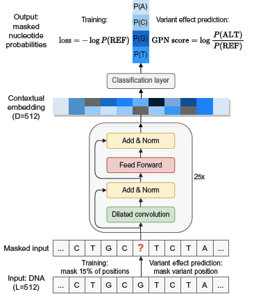{width="50%"}
:::

## Data Preparation and Pretraining Workflow
To evaluate the Genome-Pretrained Network (GPN), the initial step involved reproducing the pretraining workflow provided in the original publication. This workflow outlines the procedure for generating a dataset compatible with the model, specifically for masked language modeling over genomic sequences.

Initial attempts to apply the workflow to a baboon genome dataset encountered technical difficulties. These issues were not intrinsic to the baboon data itself but stemmed from the implementation of the workflow. To ensure compatibility with the model and maintain consistency with the original study, the Anatoptis genome—used as the reference in the published work—was selected as a pilot dataset.

After resolving the implementation issues, a dataset suitable for GPN pretraining was successfully generated. The resulting data consisted of masked genomic sequences, formatted according to the model’s input requirements.

## Model Execution Workflow and Hardware Constraints

Following the successful generation of a pretraining-compatible dataset, the next step involved attempting to run the Genome-Pretrained Network (GPN) using the available inference and training workflows. The documentation provided on the model's GitHub repository lacked detailed guidance, making it challenging to understand the complete execution process and the rationale behind certain steps.

To proceed, an alternative workflow was identified—one specifically designed for use with the Anatoptis genome. This workflow was adopted as a reference implementation for executing the GPN model.

However, significant hardware limitations emerged during this phase. The original study reported using four NVIDIA A100 GPUs, each equipped with 80 GB of RAM. In contrast, the available system utilized NVIDIA L43R GPUs with 45 GB of RAM, resulting in substantial differences in computational capacity.

As a result, attempts to execute the GPN model encountered frequent out-of-memory (OOM) errors, particularly during forward passes through the deeper layers of the network. These memory constraints posed a major obstacle and significantly hindered reproducibility under the available hardware setup.

Initial efforts to train or fine-tune the Genome-Pretrained Network (GPN) focused on applying the workflow to a baboon genome using a multi-GPU setup. The goal was to replicate the original training environment, which employed four NVIDIA A100 GPUs (80 GB RAM each). However, the available infrastructure utilized NVIDIA L43R GPUs, each with 45 GB of RAM, which introduced several compatibility and performance challenges.

Early testing began with the Anatoptis genome. Attempts to process the entire genome using the Snakemake workflow were unsuccessful due to GPU detection issues. These issues stemmed from the cluster configuration, which prevented the Snakemake environment from correctly interfacing with the available GPU hardware.

After resolving these initial configuration issues, the workflow was executed with GPU support. While this improved performance, the model began encountering memory errors after a few hours of training, even when utilizing two to four GPUs in parallel. In an effort to overcome these constraints, the number of GPUs was incrementally increased—from four to six, and finally to eight—providing an aggregate of 360 GB of GPU RAM.

Despite these efforts, the model continued to encounter out-of-memory (OOM) errors during execution. Even with eight GPUs, the memory demands of the GPN model remained prohibitive under the given cluster configuration. These persistent failures highlighted a significant limitation: the model's architecture and resource demands exceeded the practical limits of the available hardware.

Ultimately, these constraints prevented successful execution of the GPN model on the tested system.

Given the persistent memory limitations encountered during full-genome processing, an alternative strategy was implemented. Rather than inputting the entire Anatoptis genome, the data was partitioned at the chromosome level. This allowed individual chromosomes to be processed independently, while still allocating the full available GPU resources (eight NVIDIA GPUs with a combined 360 GB of RAM) to each run.

This approach proved successful. When processing a single chromosome at a time, the GPN model was able to execute without encountering memory-related failures. As a result, contextual embeddings were successfully generated for individual chromosomes of the Anatoptis genome.

However, due to time constraints near the conclusion of the project timeline, the extracted embeddings were not subjected to further downstream analysis. Although they were successfully retrieved and stored, no additional modeling, interpretation, or evaluation steps were completed within the project scope.


## Fecting the raw data 
The original sequencing data was obtained by a colleague in our research group in order to reproduce the results reported by Wang et al. (2019) [@Wang2019]. The raw data was downloaded from the SRA portal [@Sayers2022] and subsequently filtered to include only paired-end Hi-C reads from macaque samples.

To provide an overview of the material, a summary of the SRA runtable is presented in @tbl-cell-data. This table lists the accession numbers alongside key metadata for each sample. Altogether, the dataset amounts to approximately 1 TB of compressed FASTQ files, comprising ~9.5 billion reads distributed roughly evenly across five tissue types.

Table: Summary of Hi-C sequencing data across five macaque cell types, retrieved from the NCBI SRA portal for initial data exploration. {#tbl-cell-data}

| source_name            | GB        | Bases          | Reads        |
|------------------------|-----------|----------------|--------------|
| fibroblast             | 211.403275| 553,968,406,500| 1,846,561,355|
| pachytene spermatocyte | 274.835160| 715,656,614,700| 2,385,522,049|
| round spermatid        | 243.128044| 655,938,457,200| 2,186,461,524|
| sperm                  | 164.131640| 428,913,635,400| 1,429,712,118|
| spermatogonia          | 192.794420| 518,665,980,300| 1,728,886,601|


### Data Generation and Processing


The Hi-C sequencing data analyzed in this study was not generated or processed by myself, but by another member of our research group. What follows is a condensed description of their workflow, included here for clarity and reproducibility.

The data were processed using the Open2C pipeline, implemented as a GWF workflow. This framework allowed each sequencing accession (i.e., paired-end read sets) to be handled independently and in parallel, improving efficiency and scalability. The raw reads were retrieved directly from the NCBI SRA [@devteam2024sratoolkit] using the SRA Toolkit, run in a containerized environment for consistency. Downloads were saved as compressed FASTQ files, ensuring a standardized input format for downstream analysis.

Read alignment was carried out against the rheMac10 reference genome using bwa-mem in paired-end mode, following the recommended parameters provided by the Open2C team. The resulting alignments were then parsed into ligation events with pairtools, which not only distinguishes valid Hi-C contacts but also applies essential preprocessing steps such as sorting, removal of PCR duplicates, and exclusion of reads mapping to unplaced scaffolds. This filtering ensured that only informative, high-confidence pairs were retained for analysis.

The resulting valid pairs were aggregated into cooler files, the standard data structure for Hi-C contact matrices. To maximize coverage, biological replicates were merged at the cell-type level into a single matrix. These contact matrices were then “zoomified” into multiple resolutions (10 kb to 500 kb bins), enabling both fine-scale and large-scale chromatin features to be studied within the same dataset. To correct for technical biases, each matrix was subsequently normalized using iterative correction, producing balanced matrices suitable for quantitative comparison.

To identify higher-order chromatin organization, eigendecomposition of the contact matrices was performed. The first eigenvector (E1) was phased using GC content, ensuring consistent orientation of A/B compartments across chromosomes. While eigenvectors were computed at multiple resolutions during intermediate steps, all final analyses and compartment calls were performed at a uniform resolution of 100 kilobases (kb) to ensure consistency across datasets. The eigentrack shown in @fig-eigentrack illustrates a representative example of the first eigenvector at this resolution.

Finally, visualization of contact matrices and compartments was conducted within the Open2C ecosystem using matplotlib and seaborn, which enabled efficient data access and flexible plotting. These tools allowed for side-by-side comparison of balanced versus unbalanced matrices, as well as detailed compartment tracks at 100 kb resolution.

Together, this workflow produced a high-quality, reproducible dataset. The combination of containerized processing, rigorous filtering, normalization, and replicate merging ensured that the resulting chromatin contact maps were reliable and well-suited for downstream compartment analysis.


::: {#fig-eigentrack}
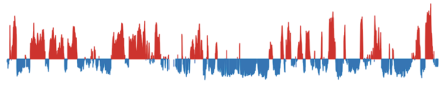{width=100%}

**Example of the first eigenvector ("eigentrack") used in A/B chromatin compartment analysis.**  
This track represents the first principal component (PC1) of the Hi-C contact matrix at a resolution of 100 kilobases (kb), with eigenvector values ranging from –1 to +1. Genomic regions with positive eigenvector values (colored red) are assigned to A compartments, typically associated with open, transcriptionally active euchromatin. Conversely, negative values (colored blue) correspond to B compartments, generally representing condensed, transcriptionally repressive heterochromatin. This eigentrack provides a quantitative basis for segmenting the genome into large-scale chromatin domains based on spatial interaction patterns.

:::


## Datahandeling of the data befor analysisi 
To load the data we use the function parse_compartment_data(file_name), which transforms the raw eigenvector track into meaningful genomic segments. The function begins by reading a CSV file that contains at least one column, e1, representing eigenvector values at 100 kb resolution.

The eigenvector track (E1) marks A/B compartments along the genome. During its generation, some bins may contain NaN values. If these are left in the dataset, each missing value is treated as a break and produces false edges, creating compartment transitions that do not actually exist. To avoid this problem, we remove all rows containing NaN values before proceeding:

``` python
     e1_100kb.dropna(inplace=True)
```
This step ensures that the sign changes in the eigenvector reflect only genuine compartment transitions.

After cleaning, the function calculates genomic coordinates by assigning each bin a start and end position based on its index and the fixed bin size of 100 kb. With these coordinates in place, it determines the sign of each eigenvector value and assigns segment IDs whenever the sign changes, so that continuous stretches of positive or negative values are grouped into compartments.

Each compartment is then summarized by calculating the mean and sum of its eigenvector values and recording the minimum start and maximum end positions. Segments with a positive mean are classified as compartment A, while those with a negative mean are classified as compartment B. To prevent artifacts caused by missing bins, the function also checks segment borders to ensure that gaps do not create artificial extents.

The function produces two outputs. The first is a tidy data frame of compartments that includes chromosome, start and end positions, mean eigenvector value, segment ID, sign, and compartment label. The second is a sorted list of all unique segment boundaries, which represent the genomic positions of compartment transitions.

To separate the data into A and B compartments, we applied a simple filtering step. For each genomic interval, we compared the compartment label (A or B) with the sign of its position relative to the nearest transition. Intervals that matched the expected direction were collected into one set, while those that fell on the opposite side were collected into another. In practice, this was done with the following code:
``` python 
    A_val = result[
        ((result['comp'] == 'A') & (result['start'] < 0)) |
        ((result['comp'] == 'B') & (result['start'] > 0))
    ].copy()
    B_val = result[
        ((result['comp'] == 'A') & (result['start'] > 0)) |
        ((result['comp'] == 'B') & (result['start'] < 0))
    ].copy()
```
This logic ensures that the data is consistently separated into values supporting the A compartment and values supporting the B compartment, based on both the compartment label and the position relative to the transition point.


## Distance between the edges 
To evaluate the availability of data across genomic distances and mitigate potential bias in downstream analyses, we calculated reverse cumulative counts of compartment edge half-distances. First, edges were identified at compartment transitions between A and B (in either direction). For each consecutive pair of such edges, we measured the genomic distance between their start positions and divided it by two, yielding the half-distance between edges.

We then binned these half-distances and computed the reverse cumulative count for each bin, which represents the number of edges with half-distances greater than or equal to that bin. This approach effectively measures the number of edges capable of contributing data at a given spatial scale. Using this metric allows us to normalize other measurements by the available data density, reducing the risk that apparent trends are driven by varying numbers of contributing edges at different distances rather than true biological effects. Counts were calculated up to 2 Mb to encompass the maximum observed separation.

::: {#fig-edge fig-cap="Reverse cumulative counts of compartment edge half-distances.."}
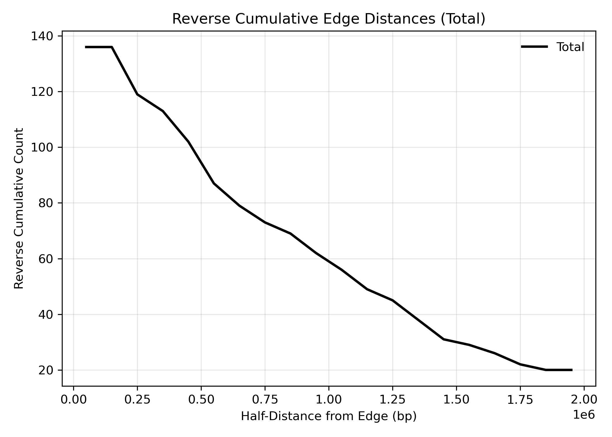{width="100%" }
:::

## Error bars calculation
To estimate uncertainty around the binned values in the plot, 95% confidence intervals (CIs) were calculated using a normal approximation to the binomial distribution. For each bin, the standard deviation was computed as:

$$
\text{SD} = \sqrt{\frac{c}{n}}
$$

where c is the observed count of events (e.g., repeat instances), and n is the number of positions (or sites) that could potentially contribute to that bin, derived from a reverse cumulative count. To avoid division by zero, a minimum denominator of 1 was enforced.

The error bars represent 95% confidence intervals, calculated as:

$$
\text{CI}_{95} = 1.96 \times \text{SD}
$$


This approach accounts for the decreasing number of possible sites at increasing distances from the reference point and provides a conservative estimate of variation across bins.

# Result 

## Compare GC conent to transition in macaca 

We compared GC content between A and B chromatin compartments for chromosome 8 and chromosome X across five Macaca cell types: fibroblasts, sperm, round spermatids, pachytene spermatocytes, and spermatogonia. Chromatin compartments were defined from A–B and B–A structural transitions, and GC content was measured separately for each compartment.

For chromosome 8, the A compartment consistently showed higher GC content than the B compartment in all cell types, which aligns with expected genomic organization. In chromosome X, however, the differences between compartments were smaller. In round spermatids, GC content was nearly identical between A and B compartments, while in pachytene spermatocytes, spermatogonia, and sperm, A and B compartments had closely overlapping GC values. Interestingly, in fibroblasts the pattern was reversed, with the B compartment displaying higher GC content than the A compartment see @fig-GC.

::: {#fig-GC fig-cap="Compartment analysis for chromosomes X and 8 in five Macaca cell types—fibroblasts, sperm, round spermatids, pachytene spermatocytes, and spermatogonia. GC content was remapped to genomic locations where chromatin structure transitions between compartments A and B. The data were separated so that each compartment contains only A or B structure. For each genomic bin, the plot shows the mean GC content, with error bars representing the standard deviation of the mean, adjusted by the effective edge contribution (accounting for how many edges contribute at longer distances).For chromosome 8, the A compartment exhibits higher GC content than the B compartment. In tissues involved in spermatogenesis, chromosome X shows similar GC content in both A and B compartments. In fibroblasts, GC content is higher in the B compartment than in the A compartment."}
 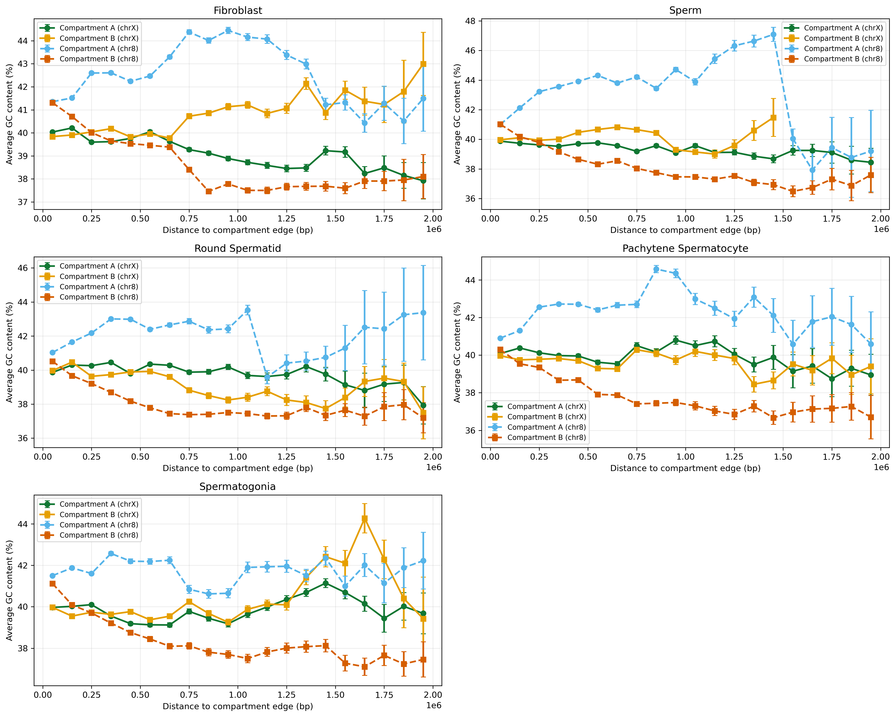{width="100%"} 
:::

## CPG islands 

To investigate chromatin dynamics during spermatogenesis in Macaca, we analyzed genome-wide changes in accessibility across successive developmental stages. We focused on genomic regions undergoing transitions from open to closed chromatin states and vice versa, as these sites represent potential regulatory hotspots that may contribute to germ cell differentiation. To explore the relationship between these transitions and CpG-rich elements, we obtained a genome-wide track of CpG islands and mapped their positions relative to the transition regions. Each transition was further annotated according to its placement within A or B compartments, with compartment A typically associated with transcriptionally active euchromatin and compartment B corresponding to transcriptionally repressed heterochromatin. By integrating chromatin transitions, CpG island mapping, and compartmentalization, we generated a stage-specific view of genome organization across spermatogenesis.

Figure @fig-CPG_islands_side_by_side illustrates the distribution of CpG island–associated transitions in fibroblasts on chromosome 8. At distances up to ~0.5 Mb, transition counts were comparable between A and B compartments, but beyond this range the A compartment exhibited substantially higher counts. This enrichment persisted until ~1.5 Mb, after which both compartments declined toward zero. The drop at larger distances likely reflects technical constraints: to measure a transition at 1.5 Mb, the minimum spacing between sites must be 3 Mb, which is relatively rare across the genome. This limitation is evident even though counts were normalized to account for the number of possible contributing sites. By contrast, chromosome X showed no compartment-specific differences in fibroblasts, with A and B compartments displaying similar counts across all distances.

In spermatogonia, no compartment-specific differences were observed on either chromosome 8 or chromosome X. Transition counts remained comparable between A and B compartments across all distances, in contrast to the fibroblast profile where chromosome 8 showed A-compartment enrichment.

In pachytene spermatocytes, chromosome 8 displayed a distinct compartmental pattern. Between 0 and ~1.25 Mb, transition counts were higher in the A compartment compared to the B compartment, but at longer distances the two converged. On chromosome X, however, A and B compartments remained similar, showing no evidence of compartment-specific enrichment.

In round spermatids, chromosome 8 again showed a bias toward the A compartment, with more transitions observed from 0 to ~1.1 Mb. A comparable, though slightly shifted, pattern was seen on chromosome X, where enrichment in the A compartment was detected between ~0.25 and 1.3 Mb.

Finally, in mature sperm, chromosome 8 exhibited consistent A-compartment enrichment from 0 to ~1.5 Mb. On chromosome X, the effect was more modest, with only a slight increase in A-compartment counts between ~1.0 and 1.75 Mb.

Together, these results reveal stage-specific differences in the relationship between chromatin transitions, CpG islands, and genome compartmentalization. Fibroblasts and spermatogonia lack strong compartmental biases, while later spermatogenic stages, particularly pachytene spermatocytes, round spermatids, and mature sperm, display pronounced enrichment of CpG island–associated transitions in the A compartment, especially on chromosome 8.

::: {#fig-CPG_islands_side_by_side}
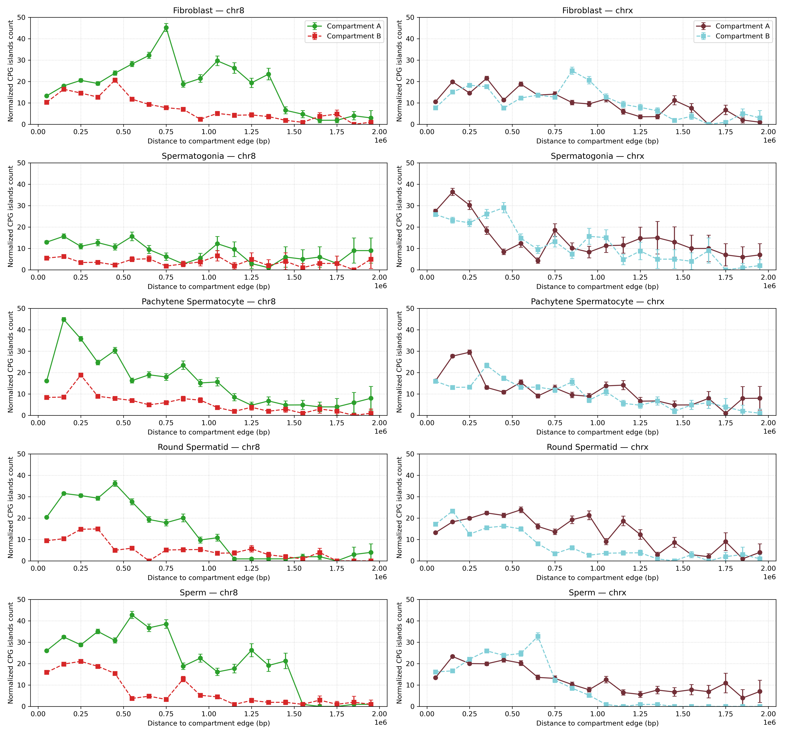{width=100%}

**Figure:** cpgislands
:::


## simple repeat 
We next examined the relationship between chromatin transitions and simple repeats using the same strategy as for CpG islands. The genomic positions of simple repeats were remapped relative to transition sites, and the counts in each distance bin were normalized by the number of transition sites that could contribute to that bin. This approach allowed us to determine whether simple repeats are enriched near transition regions and whether their distribution differs between A and B compartments.

In fibroblasts, chromosome 8 showed a slight enrichment of simple repeats in the B compartment compared to the A compartment. On chromosome X, however, the opposite pattern was observed, with more simple repeats detected in the A compartment. Across both chromosomes, simple repeats were generally more abundant close to transition sites, with their frequency declining as distance increased.

In spermatogonia, chromosome 8 did not display any clear compartment-specific differences, as simple repeat counts were comparable between A and B compartments across all distances. On chromosome X, simple repeats were evenly distributed between compartments up to ~0.5 Mb, but from ~0.5 to 2 Mb the A compartment contained higher counts. Similar to fibroblasts, spermatogonia also showed strong enrichment of simple repeats near transition sites, with counts decreasing at greater distances.

In pachytene spermatocytes, chromosome 8 again showed more simple repeats in the B compartment than in the A compartment, with a strong enrichment close to transition sites. On chromosome X, an A-compartment bias emerged beyond ~0.75 Mb, where more simple repeats were observed in A compared to B.

In round spermatids, chromosome 8 displayed a consistent bias toward the B compartment, with more simple repeats present there than in the A compartment. By contrast, chromosome X showed the opposite trend, with higher counts of simple repeats in the A compartment.

Finally, in mature sperm, chromosome 8 continued to show an enrichment of simple repeats in the B compartment, while chromosome X again displayed more simple repeats in the A compartment.


::: {#fig-simpel_repeat_side_by_side}
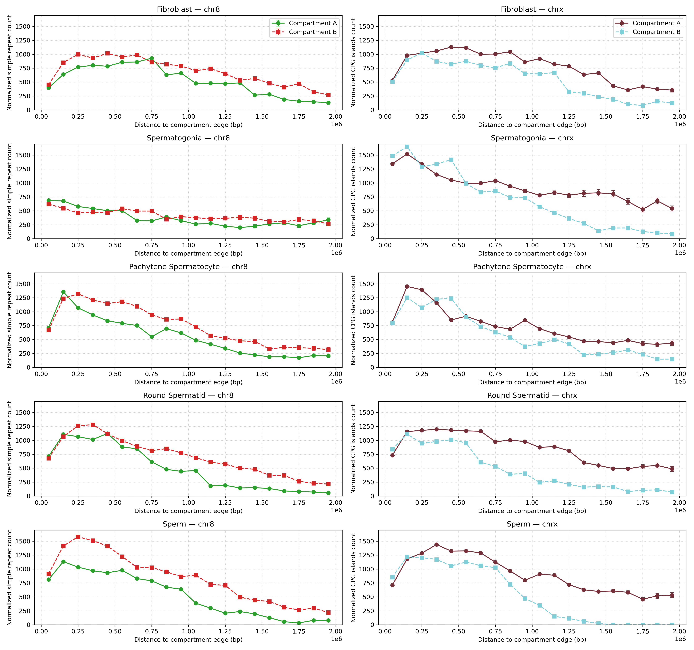{width=100%}

**Distribution of simple repeats relative to chromatin transition sites in fibroblasts and spermatogenic stages.**  
Chromosome 8 is shown on the left and chromosome X on the right. Rows represent different cell types: fibroblasts, spermatogonia, pachytene spermatocytes, round spermatids, and mature sperm. In each panel, simple repeat counts were mapped relative to transition sites, and values in each distance bin were normalized by the number of transition sites that could contribute to that bin.  

:::


## nested repeat 
We also analyzed the distribution of nested repeats relative to chromatin transitions using the same mapping and normalization strategy applied to CpG islands and simple repeats. The results for nested repeats closely paralleled those observed for simple repeats.

In fibroblasts, chromosome 8 showed more nested repeats in the B compartment, while chromosome X displayed a bias toward the A compartment. In spermatogonia, chromosome 8 showed no compartment-specific differences, whereas chromosome X exhibited an A-compartment enrichment beyond ~0.5 Mb. Pachytene spermatocytes, round spermatids, and mature sperm followed the same overall trends: chromosome 8 consistently contained more repeats in the B compartment, while chromosome X showed enrichment in the A compartment. Across all stages and both chromosomes, nested repeats were most abundant near transition sites, with counts decreasing at larger distances.

::: {#fig-nested_repeat}
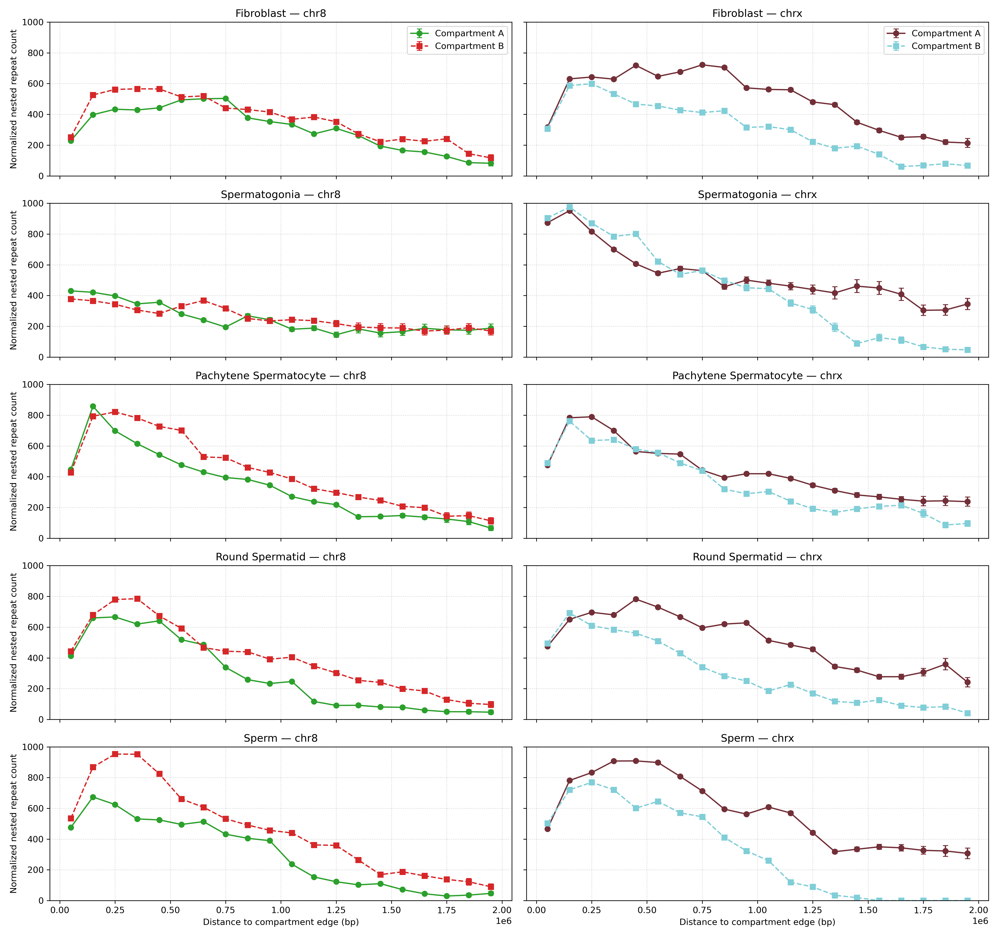{width=100%}

**Distribution of nested repeats relative to chromatin transition sites in fibroblasts and spermatogenic stages.**  
Chromosome 8 is shown on the left and chromosome X on the right. Rows represent different cell types: fibroblasts, spermatogonia, pachytene spermatocytes, round spermatids, and mature sperm. In each panel, nested repeat counts were mapped relative to transition sites, and values in each distance bin were normalized by the number of transition sites that could contribute to that bin.  

:::

## Control to with A andf B compartment
To verify that our compartment analysis was not biased by compartment assignment, we performed a negative control experiment. Normally, the data are separated into A or B compartments (as described in the methods section). In the control analysis, however, the data were instead partitioned according to compartment transitions — whether regions lay on an A→B or B→A boundary. Because Hi-C data reflect DNA contacts independently of strand orientation, no systematic difference was expected between the two directions.

As an additional safeguard, the same experiment was repeated for CpG islands. Filtering was carried out with the following code snippet, which reverses the logic of the standard A/B assignment:

``` python 
    A_val = result[
        ((result['comp'] == 'A') & (result['start'] < 0)) |
        ((result['comp'] == 'A') & (result['start'] > 0))
    ].copy()
    B_val = result[
        ((result['comp'] == 'B') & (result['start'] > 0)) |
        ((result['comp'] == 'B') & (result['start'] < 0))
    ].copy()
```
The resulting profiles in Figure @fig-CPG_normalized_chr_ab_new illustrate the distribution of CpG islands relative to compartment transitions (A→B vs. B→A) on chromosomes 8 and X across multiple cell types.

On chromosome 8, fibroblasts and sperm show a pronounced asymmetry: between ~0.5 and 1.5 Mb from transition edges, CpG islands are more abundant in regions undergoing A→B transitions than in those switching from B→A. This suggests that CpG islands are preferentially associated with loci moving from active to repressive chromatin environments in these contexts. In round spermatids, a similar enrichment is observed closer to the transition site (0–1 Mb), again with higher counts in A→B compared to B→A. By contrast, in spermatogonia and pachytene spermatocytes, CpG islands display a more balanced distribution, with comparable counts in both transition directions across the full range of distances examined.

On chromosome X, no strong directional bias is detected. Across all tissues analyzed—including fibroblasts, spermatogonia, pachytene spermatocytes, round spermatids, and sperm—the counts of CpG islands at A→B and B→A transitions remain similar across the 0–2 Mb distance range. This uniformity suggests that, unlike chromosome 8, the X chromosome does not exhibit a consistent asymmetry in the distribution of CpG islands relative to compartment switching.

Together, these results indicate that CpG islands are not randomly associated with chromatin transitions but instead show chromosome- and stage-specific patterns. Chromosome 8 exhibits directional enrichment of CpG islands, particularly in fibroblasts, sperm, and round spermatids, while the X chromosome appears more symmetric, lacking a consistent bias between A→B and B→A transitions.

::: {#fig-CPG_normalized_chr_ab_new fig-cap= "Negative control analysis of CpG islands on chromosome 8 across five macaque cell types (fibroblast, spermatogonia, pachytene spermatocyte, round spermatid, and sperm). A→B (AB) and B→A (BA) compartment transitions were compared."}
 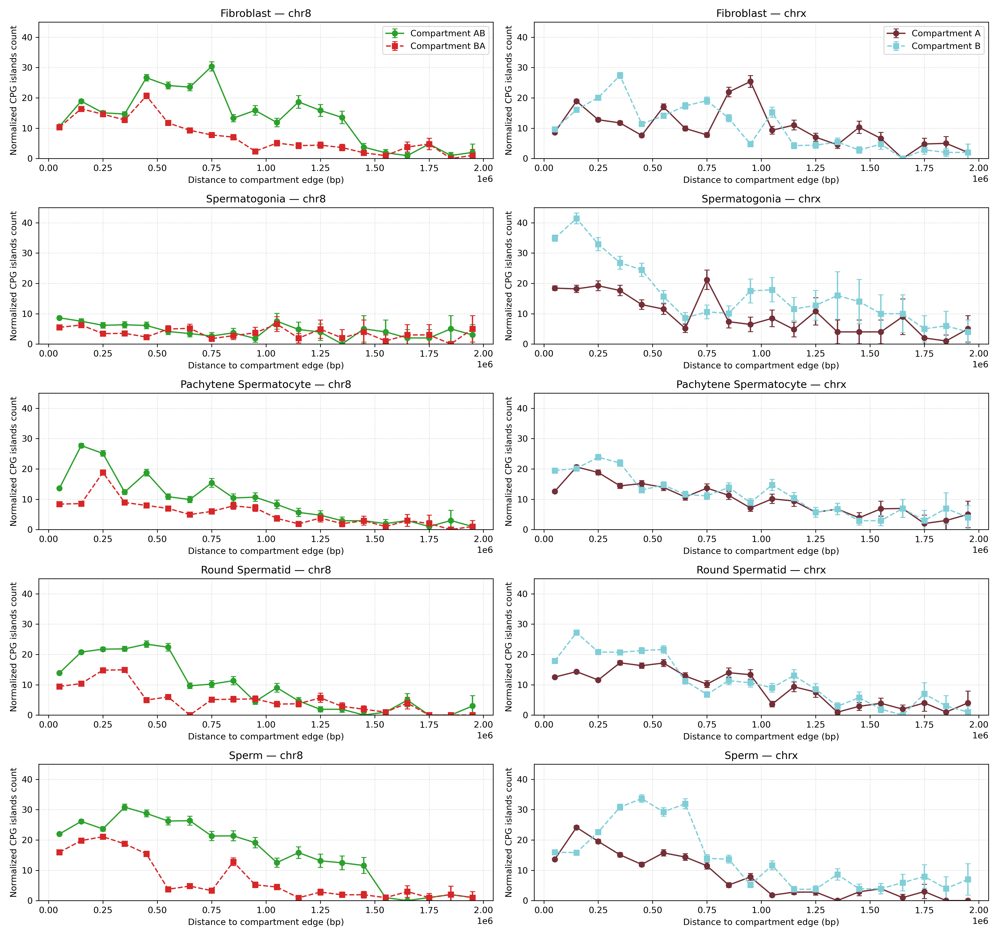{width="100%"} 
:::

the control was also done on GC content here we see there is a simular procentece of GC in each bin across all tisues @suppfig-GC_content_contol. 
The same was done with simple repates and nested repeat @suppfig-simple_repeat_contol and @suppfig-nested_repeat_contol


# Dissusion 

## GC content and A/B compartmentalization on the macaque X chromosome

Across autosomes, GC content is a strong, well-established correlate of A/B compartment identity: GC-rich, gene-dense regions tend to occupy active A compartments, whereas AT-rich regions are depleted for genes and fall into repressive B compartments. Our analysis of macaque chromosome 8 conforms to this canonical relationship in all five cell types examined, reinforcing that our compartment calling and GC mapping are technically sound and biologically consistent. In contrast, chromosome X departs from this pattern in several notable ways. First, the magnitude of GC differences between A and B is markedly reduced in spermatogonia, pachytene spermatocytes, round spermatids, and sperm. Second, fibroblasts show an apparent inversion—higher GC in B than in A.

Our analysis computes GC content in 5-bp windows genome-wide and aligns those values to A/B compartment transition edges identified from the Hi-C PC1 track at 100-kb resolution. GC values are summarized in distance-from-edge bins, and uncertainty is quantified using the reverse-cumulative count of available edges at each distance. This design reduces distance-dependent sampling bias but has three caveats: (i) edge positions are localized only to 100 kb, so features within ~±50 kb of a boundary may be blurred by binning; (ii) the effective sample size declines with increasing distance from edges across all chromosomes (due to finite domain lengths and masked gaps), which widens confidence intervals at longer distances even after normalization; and (iii) because PC1 was phased using GC to orient A/B, there is potential circularity—especially on X, where regulation is atypical—so cross-phasing with independent marks (e.g., H3K27ac/H3K9me3, replication timing, Lamin B1, RNA-seq) is recommended to validate label orientation.

Biological implications

That chromosome 8 obeys the classic GC–A/B relationship while chromosome X does not highlights an important distinction: GC content is a robust predictor of compartment state on autosomes but not necessarily on sex chromosomes. The attenuated contrast and apparent fibroblast reversal suggest that on X, base composition is a strong prior for compartmentalization but not a determinant under all conditions. Regulatory programs such as dosage compensation, sex-specific chromatin environments, and the unusual sequence architecture of the X can override the typical GC→A mapping, compressing or inverting the signal.

These findings argue for additional validation when interpreting compartment states on chrX. Cross-referencing with independent chromatin marks and stratifying X into domain types (e.g., ampliconic versus non-ampliconic, CGI-rich versus CGI-poor) would help clarify whether the reduced GC–compartment correlation reflects biological mechanisms or labeling artifacts. More broadly, the results underscore that while GC content is a useful baseline for compartment identity, its predictive power may be context-dependent—particularly on the sex chromosomes, which are subject to distinct evolutionary and regulatory pressures.

## CpG islands and chromatin transitions during spermatogenesis
(this is kinda shit)
Our analysis reveals that CpG island–associated chromatin transitions show distinct, stage-specific, and chromosome-specific patterns across macaque spermatogenesis. On chromosome 8, fibroblasts already exhibit a strong enrichment of CpG island–linked transitions in the A compartment, particularly at distances up to ~1.5 Mb. In spermatogonia, by contrast, transitions are distributed more evenly between compartments, with little evidence of bias. At later germline stages—pachytene spermatocytes, round spermatids, and mature sperm—an A-compartment bias re-emerges, indicating that CpG islands become increasingly associated with open, transcriptionally active regions as chromatin undergoes extensive remodeling during meiosis and spermiogenesis. This developmental trajectory suggests that the relationship between CpG islands and compartment identity is not fixed but dynamically regulated, absent in early germline precursors, present in differentiated somatic fibroblasts, and reinforced during the major reorganizational phases of germ cell maturation.

(this is okay)
By contrast, the X chromosome generally shows weaker and more variable compartmental differences. In fibroblasts and spermatogonia, no enrichment is observed, mirroring the pattern seen on chromosome 8. In round spermatids, however, a modest A-compartment bias emerges, and in sperm this trend persists but remains less pronounced than on the autosome. These findings align with the idea that the X chromosome is subject to distinct regulatory pressures—such as meiotic sex chromosome inactivation (MSCI) and post-meiotic repression—that may dampen or delay the coupling between CpG islands and active chromatin states. The X appears less responsive to the same sequence-based cues that strongly partition CpG island–associated transitions on autosomes.

CpG islands are well known to act as promoters, boundary elements, and nucleation sites for chromatin remodeling. Their enrichment within A compartments during later spermatogenic stages suggests that they may stabilize or reinforce transcriptionally permissive domains at precisely the time when the 3D genome undergoes wholesale remodeling. In particular, pachytene spermatocytes and spermatids show both loss of canonical TADs and emergence of refined compartmental structures. CpG islands could therefore help define or insulate these reorganized domains, ensuring that key regulatory programs for gamete development are maintained.

everal factors caution against over-interpretation. First, transition edges are identified at 100-kb resolution, which limits positional accuracy; associations between CpG islands and compartments may therefore be blurred within ±50 kb of boundaries. Second, the normalization procedure compensates for distance-dependent availability of transitions, but the steep decline in counts at longer distances still reflects limited genomic sampling. Third, our analysis does not distinguish between CpG islands at active promoters, intergenic CGIs, or those embedded within repeats—categories that may behave differently. Finally, on the X chromosome, compartment labels are phased by GC content, raising the possibility of mislabeling in contexts where the GC–compartment correlation is weak.

## Discussion: Simple repeats and compartment-specific enrichment

Our analysis of simple repeats reveals consistent stage- and chromosome-specific differences in their relationship to chromatin compartments. On chromosome 8, simple repeats are preferentially associated with the B compartment in fibroblasts, pachytene spermatocytes, round spermatids, and mature sperm, with spermatogonia representing the only stage without a clear bias. By contrast, the X chromosome shows the opposite pattern: simple repeats are generally enriched in the A compartment across most developmental stages, with only minor differences in spermatogonia at shorter distances. This reciprocal behavior between the autosome and the sex chromosome highlights that the genomic context strongly shapes how repetitive elements interact with higher-order chromatin structure.

A second consistent feature across all stages and both chromosomes is the sharp enrichment of simple repeats near chromatin transition sites, with counts declining steadily at larger distances. This pattern suggests that simple repeats may preferentially accumulate at or around regions where chromatin states switch between active and inactive configurations. Whether repeats directly contribute to establishing such boundaries, or instead persist in these regions due to reduced selective constraints, remains unclear. Nonetheless, their proximity to transition sites supports the idea that repetitive elements may play a structural role in shaping domain organization, either by altering nucleosome positioning, promoting local heterochromatinization, or acting as anchors for chromatin remodeling complexes.

The contrasting biases between chromosome 8 and the X chromosome may reflect differences in the sequence composition, regulatory environment, and evolutionary dynamics of these genomic regions. On autosomes, simple repeats appear to reinforce repressed, heterochromatic domains, while on the X they are more often linked to active A compartments. One possible explanation is that the unique regulatory pressures on the X chromosome—such as dosage compensation, sex-specific silencing, and its repeat-rich architecture—decouple the typical relationship between repeats and heterochromatin, allowing repeats to persist or even become enriched in euchromatic environments.

Together, these findings suggest that simple repeats are not randomly distributed with respect to 3D genome organization, but instead exhibit compartment- and chromosome-specific associations that shift across developmental stages. Their enrichment near transition regions in particular points to a potential role in modulating or stabilizing chromatin boundaries during spermatogenesis. Further work, integrating repeat subtypes, transcriptional data, and histone modification profiles, will be needed to test whether these associations are structural, regulatory, or a byproduct of local sequence composition.

## Control analysis of A→B vs. B→A transitions

The control analysis was designed to ensure that our compartment-based approach was not biased by the way A and B compartments were assigned. Because Hi-C data capture spatial proximity without strand directionality, no systematic difference should exist between transitions designated as A→B versus B→A. Under a strict null expectation, counts of CpG islands should therefore be distributed symmetrically across both categories.

Our results confirm this expectation on the X chromosome, where all cell types exhibited comparable CpG island counts at A→B and B→A transitions. This uniformity suggests that the labeling of compartments on X was not introducing an artificial bias. By contrast, chromosome 8 showed directional enrichment of CpG islands at A→B transitions in fibroblasts, round spermatids, and sperm. The fact that this asymmetry was stage-specific, and absent in spermatogonia and pachytene spermatocytes, argues against a technical artifact. Instead, it points to a genuine biological difference in how CpG islands are distributed relative to chromatin reorganization on chromosome 8.

Together, these findings indicate that the control analysis functioned as intended. The absence of systematic A→B versus B→A differences on X validates the robustness of our compartment assignment procedure, while the enrichment observed on chromosome 8 likely reflects underlying biology rather than methodological bias. In particular, the preferential association of CpG islands with A→B transitions in certain cell types may signal a directional aspect of chromatin remodeling, where regulatory elements are disproportionately positioned at boundaries moving from active to inactive states.


# Conclussion 


# Supplemental Figures

::: {#suppfig-GC_content_contol }
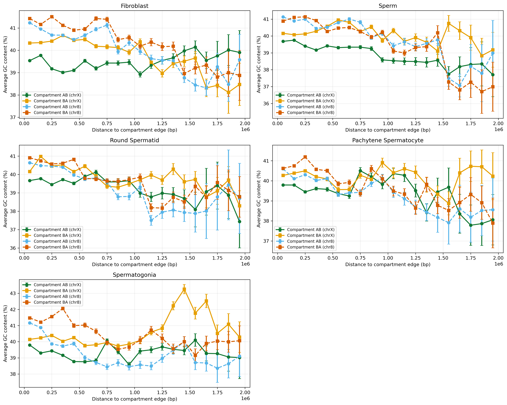{width=100%}

**Figure:** GC content but contol
:::

::: {#suppfig-simple_repeat_contol }
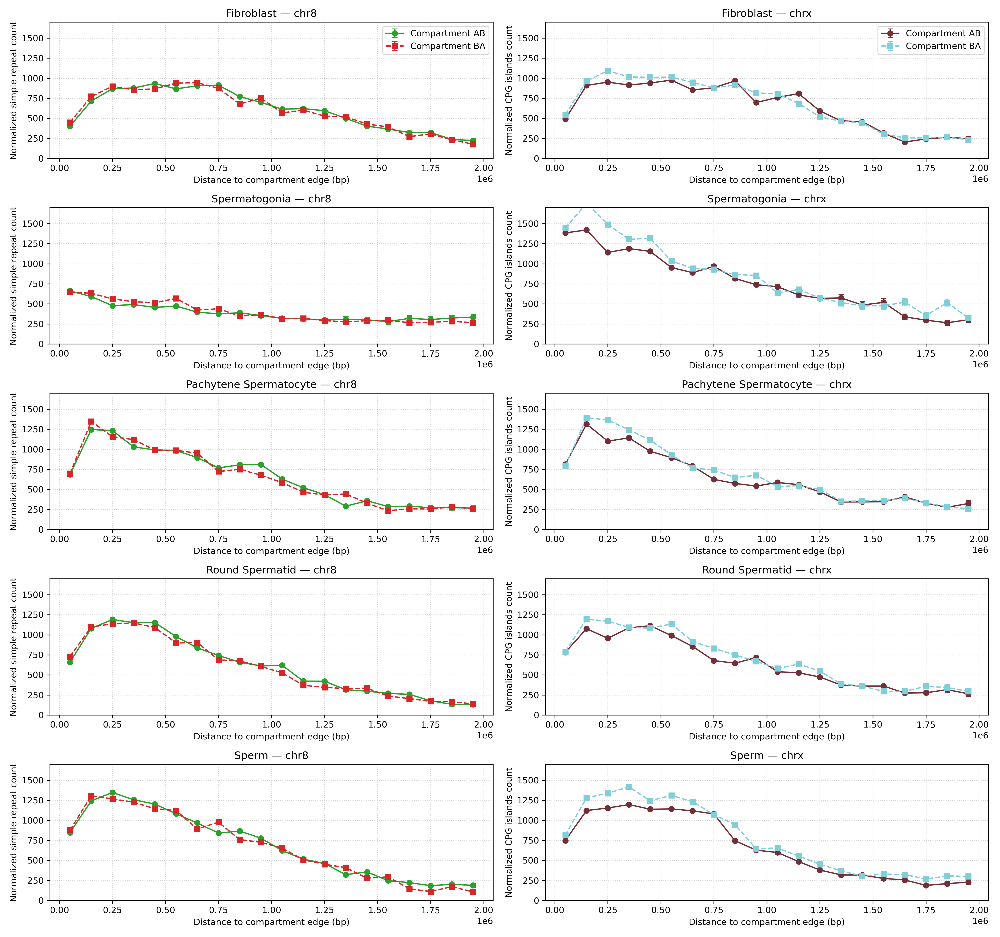{width=100%}

**Figure:** GC content but contol
:::


::: {#suppfig-nested_repeat_contol }
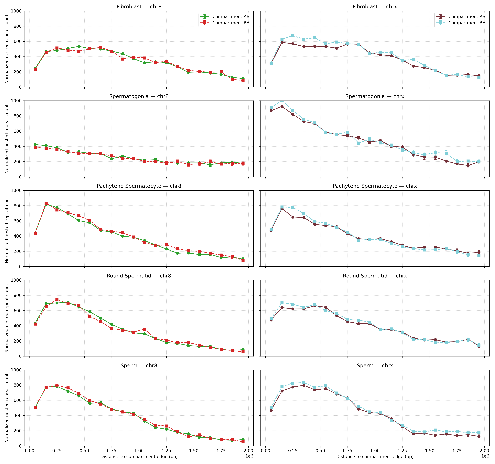{width=100%}

**Figure:** GC content but contol
:::


# Aknowledgements
## People
I would like to extend my sincere gratitude to my supervisor, Kasper Munch, for his guidance and support throughout this project. His sparring and scientific literacy have been invaluable in refining my ideas and shaping the direction of this work. I am especially thankful for Kasper’s enthusiasm, which has been a source of motivation during this process. His expertise and insights were instrumental in setting up the Quarto templates and providing support for the discussion. His constructive feedback on the manuscript has greatly improved its quality. I feel fortunate to have had the opportunity to learn from and work with such a knowledgeable and dedicated mentor.

I would also like to thank alberte peithersen for the help correcting the report 

## Compute
All computations were performed on GenomeDK (GDK), an HPC cluster located on Aarhus Uninversity, and most of the processing of the data was handled by a gwf workflow (GenomeDK 2023), a workflow manager developed at GDK. Developing the manuscript and all associated writing, editing, and rendering the project was also performed on GDK so work seemlesly with the analysis. I would like to thank GDK and Aarhus University for providing computational resources and support that contributed to these research results. None of this would have been possible on my own laptop from 2013.

Use of Generative Artificial Intelligence
As per Aarhus University guidelines (IT n.d.), I hereby disclose my use of Generative Artificial Intelligence (GAI) tools during the preparation of this thesis. All usage was conducted critically and responsibly, ensuring that the final work remained my own and adhered to academic integrity standards. These tools supplemented my expertise and accelerated routine tasks, but all creative, analytical, and scientific contributions are my own.

## Copilot
I used Copilot for code completion and debugging, as well as modifying existing code to reflect updated variables and experimental needs.

## ChatGPT
ChatGPT provided syntax support, to accelerate my learning of new programming languages. it also help me with proof reading.

## Cloudi AI

Cloudi AI helped with debugging my code, making it easier to identify and fix errors during the analysis process. It also supported smoother progress by suggesting improvements to my workflow.